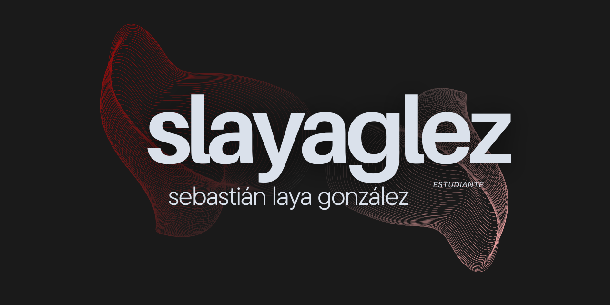

 
 

## Who am I? 🖐🏼
I'm Sebastián Laya González, and I was born in Venezuela but grew up in **Tenerife, Canary Islands**. Right now I find myself studying Multiplatform Application Development in **IES Puerto de la Cruz**, Tenerife and I'm looking up to finish my Higher Vocational Course, which involves lessons over technologies like **Java, HTML, Docker, PostgreSQL** and much more. In addition I'm also experimented with videogames creation with tools like Unity3D and Blender (and open to start learning C#).

 

My hobbies are doing **MMA, videogames and Rock'n'Roll**, more specifically, I've practiced Brazilian Jiu-Jitsu and Karate, I'm a big fan of *Fromsoftware* games and I love *Extremoduro* or *Marea*, which are spanish Rock bands. I also love gastronomy, since I've been a waiter for a couple of years and know a lot about high quality wines and meats from different parts of the Mediterranean.

> El valor de un hombre no es más grande que sus ambiciones.
> >  -Marco Aurelio

 
 

## Programming habilities 👾
#### Here are some technologies where I'm experienced

  
  
  
  
  
  
  
  
  
  
  
  
  

 
 

## Contact 💬
#### You can contact me via email **sebastianlaya01@gmail.com**

#### Or via Linkedin down here!

